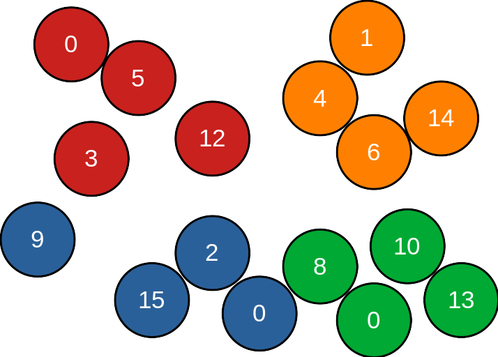
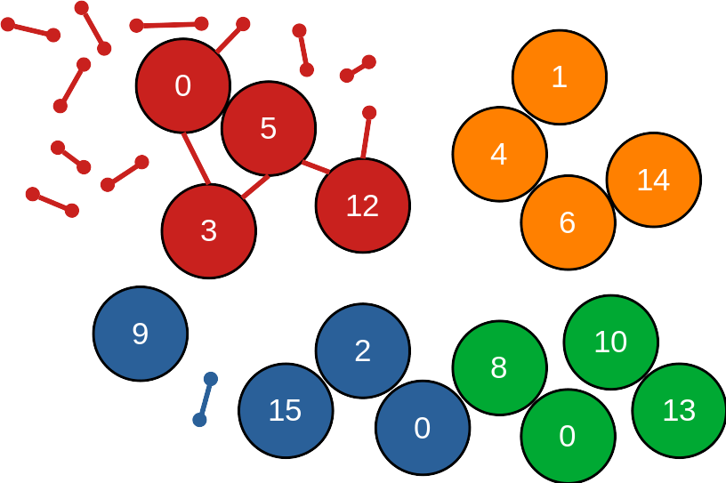
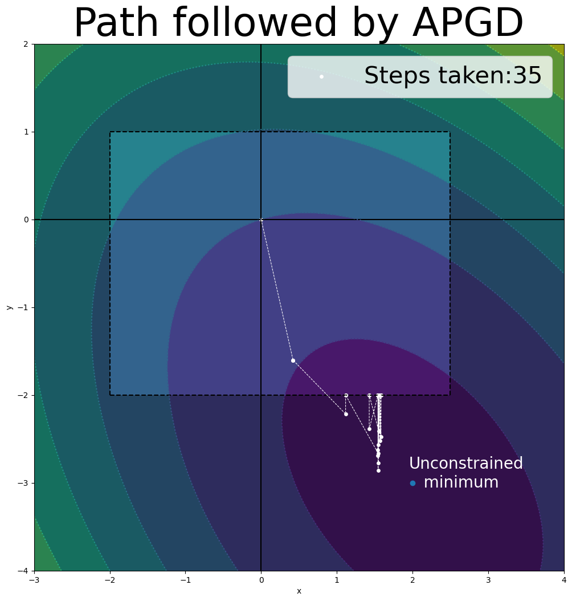

# Day 2: aLENS introduction (part 1) 

https://github.com/flatironinstitute/aLENS

https://lamsoa729-alens.readthedocs.io/en/latest/quickstart.html


## Today's Agenda

| Day 2  (Tuesday 6/6) | aLENS (part 1) |
| --- | --- |
| 2:00PM | Introduction to _aLENS_ (what can it do?) <br /> Speaker: **Adam Lamson** |
| 2:30PM | A peek into the numerical methods behind _aLENS_  <br /> Speaker: **Bryce Palmer** |
| 3:00PM | Break |
| 3:10PM | Tutorial: Running _aLENS_ for the first time <br /> Instructor: **Adam Lamson** |
| ~3:45PM | Tutorial: Paraview and visualizing <br /> Instructor: **Adam Lamson/Bryce Palmer**|
| ~4:00PM | Break  |
| ~4:10PM | Parameter explanation and playing with simulations  <br /> Instructor: **Adam Lamson**|


## Pre-tutorial software installation

- Docker desktop
  - Sign up at docker hub [https://hub.docker.com/](https://hub.docker.com/)
  - Download docker desktop [https://www.docker.com/products/docker-desktop/](https://www.docker.com/products/docker-desktop/)
  - (Optional) Docker engine
    - Linux [https://www.linux.com/topic/desktop/how-install-and-use-docker-linux/](https://www.linux.com/topic/desktop/how-install-and-use-docker-linux/)
    - Mac [https://medium.com/crowdbotics/a-complete-one-by-one-guide-to-install-docker-on-your-mac-os-using-homebrew-e818eb4cfc3](https://medium.com/crowdbotics/a-complete-one-by-one-guide-to-install-docker-on-your-mac-os-using-homebrew-e818eb4cfc3)
- paraview [https://www.paraview.org/download/](https://www.paraview.org/download/)
- hdf5 view
  - Sign up for service [https://www.hdfgroup.org/register/](https://www.hdfgroup.org/register/)
  - Download at [https://www.hdfgroup.org/downloads/hdfview/#download](https://www.hdfgroup.org/downloads/hdfview/#download)


## Setup container

1. Open [docker desktop](https://www.docker.com/blog/getting-started-with-docker-desktop/)
    <!-- TODO Make overview for dockerhub image -->

1. Pull latest docker image from [dockerhub](https://hub.docker.com/r/lamsoa729/alens)

   ```bash
   $ docker pull lamsoa729/alens:latest
   ```
Note: May need `sudo` depending on your docker installation.


# aLENS: What is it good for?
### Speaker: Adam Lamson
#### [Presentation (click me)](presentations/23-06-05_BPM_workshop_aLENS_intro.pdf)
       


# A peek into the numerical methods behind aLENS
### Speaker: Bryce Palmer

- Domain decomposition/load balancing/neighbor detection
- Particle (rod) mobility
- Spring/collision resolution


## Domain decomposition/load balancing/neighbor detection

aLENS automates many of the essential particle-based simulation tasks for you. 

It automatically performs 
- Domain decomposition to ensure that the number of particles per process remains constant.
- Load balancing to rebalance the particle distribution as the system evolves. 
- Neighbor detection to check for collisions between particles.


## Example domain decomposition:

       


## An important caveat to be aware of

aLENS' Domain decomposition and load balancing ensures that the number of *particles* per process remains constant, not the number of springs. 
  
This can lead to load imbalance and increased communication costs/computation time. 


## Example with poor load balancing 

If we have a large number of springs in our upper left-hand corner, then the red process is now overloaded with work, containing 18 objects, whereas the other processes have 4-5 objects. 

       
<!--  -->

As a result, aLENS performs best when the distribution of springs is similar to the distribution of particles. If you have strong differences between the two, that's fine; it'll just cause some inefficiency. 


## Particle mobility

The mobility problem consists of finding the unconstrained translational and rotational velocities of all particles given the forces and torques that act upon them. We abstractly write this as $V = M(F)$. 

aLENS was programmed to accept any linear mobility operator. 


## What mobility operators does aLENS support?

aLENS currently only supports "dry" hydrodynamic mobility where each rod's motion is resisted by *local* viscous drag.

Local drag has some caveats:
- Rods and springs are suspended in space unless acted upon by a force (we typically ignore gravity).
- The perpendicular drag coefficient is larger than the parallel coefficient.
  - Can lead to visually unintuitive motion. 


## What mobility operators will aLENS 2.0 support?

- Local drag
- Many-body hydrodynamics (via slender body theory, force dipoles, and boundary integrals)
- Dry inertial (no fluid)


## Spring/collision resolution

Motion, according to the *unconstrained* mobility problem, can cause particles to overlap and springs to violate Hooke's law. 

aLENS addresses this issue by writing the spring force and collision-free conditions as linearized constraints. The unknowns, which we must solve for at each timestep, are thus the collision and spring force magnatudes $\lambda$.
- For springs, the constraint seeks to minimize the difference between $\lambda$ and $k\Delta x$.
- For collisions, the constraint seeks to minimize the overlap between particles while ensuring that non-overlapping particles have zero collision force.

Thogether, these constraints form a constrained convex optimization problem, which can be solved via projected gradient descent (using either APGD or BBPGD).


## Example projected gradient descent solve:

       


# Tutorial: Running aLENS for the first time 
### Instructor: Adam Lamson


## Creating a container

1. Open [docker desktop](https://www.docker.com/blog/getting-started-with-docker-desktop/)
    <!-- TODO Make overview for dockerhub image -->

1. Pull latest docker image from [dockerhub](https://hub.docker.com/r/lamsoa729/alens)

   ```bash
   $ docker pull lamsoa729/alens:latest
   ```
   NOTE: May need `sudo` depending on your docker installation.

1. Make a folder to access your simulation data stored generated in docker container

   ```bash
   $ mkdir my_alens_data; cd my_alens_data
   $ pwd
   ```
   This will be the path to your data folder. You will need to replace `<path/to/my_alens_data>` with this path in the next step.


4. Create and run a docker container from the image pulled from dockerhub
   ```bash
   docker run --volume=<path/to/my_alens_data>:/root/Run --name alens -dit lamsoa729/alens:latest
   ```

You now have access to an environment that can run aLENS but will create data files on your local computer.


## Running aLENS inside docker containter

1. To open a CLI with your docker container, you can either use your native terminal or docker desktop's GUI. 
 
    * For native terminal
  
      ```bash
      docker exec -it alens /bin/bash
      ```

    * For docker desktop, click the running `alens` container while in the containers section
      <!--  -->
             


      * then click the `terminal` tab in the upper middle of the window 
        
    
    You may treat this CLI just like any terminal connected to a remote server. 


2. From this CLI, navigate to the `Run` directory
    ```bash
    cd /root/Run 
    ```
    This is your directory you connected to your local computer in step 4 of the previous section.

3.  While still in the CLI, copy the example configuration to the data folder

    ```bash
    cp -r ~/aLENS/Examples/MixMotorSliding .
    cd MixMotorSliding
    ```

4.  Copy the contents of the `Run` template directory from aLENS to the data folder as well

    ```bash
    cp -r ~/aLENS/Run/* .
    ```

    You should now see an `aLENS.X` executable in this directory along with `result` and `script` directories containing useful scripts for processing, storing, and cleaning up generated files.


5.  Run _aLENS_

    ```bash
    ./aLENS.X
    # or to control the number of cores used
    OMP_NUM_THREADS=<number_of_cores> ./aLENS.
    ```

6.  Stop the run by pressing `[ctrl+c]`
7.  Execute run again as we did in step 4. Notice that the aLENS simulation continues from the last snapshot. This is a very useful restart feature for longer runs.
8. To restart a simulation from the beginning, delete the `result/results#-#` directories and `TimeStepInfo.txt` file, then run again.
    ```bash
    rm -r result/result* TimeStepInfo.txt
    ./aLENS.X
    ```
    The `TimeStepInfo.txt` file contains the information about the last successful snapshot and is used to restart a simulation from that state.


## Parameter and initial configuration files

The executable `aLENS.X` reads 2 input files (4 if specifying starting object configurations):

- `RunConfig.yaml` specifies simulation parameters for the system and rod-like objects (sylinders).
- `ProteinConfig.yaml` specifies types and parameter of crosslinking and motor objects (proteins).
- `TubuleInitial.dat` specifies initial configuration of sylinders (optional).
- `ProteinInitial.dat` specifies initial configuration of proteins (optional).


## Data organization file formats
Data is put into `result/result#-#/` directories to prevent surpassing file limit on ceph.

* Ascii data files: `SylinderAscii_#.dat`, `ProteinAscii_#.dat`
  * Human readable positions and orientations
* XML VTK files: `ConBlock_r#_#.vtp`, `Sylinder_r#_#.vtp`, `Protein_r#_#.vtp`
  * Binary files containing all information of systems state. Multiple files for different MPI ranks.
* VTK header files: `ConBlock_#.pvtp`, `Sylinder_#.pvtp`, `Protein_#.pvtp`
  * Human readable files of VTK format for XML files

More info can be found at:
* [https://github.com/flatironinstitute/aLENS](https://github.com/flatironinstitute/aLENS)
* [https://lamsoa729-alens.readthedocs.io/en/latest/quickstart.html](https://lamsoa729-alens.readthedocs.io/en/latest/quickstart.html)


# Paraview and visualizing
### Instructors: Adam Lamson and Bryce Palmer


## First visualization (using pre-made visualization file)
Visualizations are created and interacted with using paraview. Be sure to have this software installed [https://www.paraview.org/download/](https://www.paraview.org/download/) (This tutorial was made using ParaView-5.9.1). Tutorials for using paraview for general data visualization can be found on their [website](https://docs.paraview.org/en/latest/).
1. After running your [first simulation](quickstart), your `results` directory will have multiple result subdirectories inside of it.
    
    ```bash
    $ cd ~/Run/MixMotorSliding/result
    $ ls 
    Clean.sh  PNG  Result2PVD.py  compress.sh  result0-399  result400-799  result800-1199  simBox.vtk  uncompress.sh
    ```


2. To visualize the data, we must first run the `Result2PVD.py` script.
    
    ```bash
    $ python3 ./Result2PVD.py
    $ ls ./*.pvd
    ./ConBlockpvtp.pvd  ./Proteinpvtp.pvd  ./Sylinderpvtp.pvd
    ```
    
    This creates ParaView data (.pvd) files that point to the `.pvtp` files in the various result subfolders, allowing `Paraview` to load all the files belonging to a sequence in the correct order. It is safe to execute this script while `aLENS.X` is still running and writing data so analysis can occur before a simulation finishes.


3. Open up the paraview GUI.
    
    .png)


4. The quickest way to get interpretable visualizations is to load a pre-made ParaView state (.pvsm) file that has filters already applied to the data to be loaded. One has been provided in the MixMotorSliding example.
    - In the upper left hand corner, click `Files -> Load State`.
           


    - From the pop up window, navigate to the mounted Run directory on your local machine and click `MixMotorSliding.pvsm` and click OK.

               


5. In Load State Options choose ‘Search files under specified directory. Data Directory should populate with the correct run directory on your local machine. Select ‘Only Use Files In Data Directory’ and press OK.
       


6. Run visualization using run button at the top of the screen.
       
    <!--  -->


7. Objects in the simulation are shown on the left-hand bar and can be turned on and off by clicking on the eye icon next the the names. (The more objects shown, the slower the visualization will run)
    
           
           
    <!--  -->


8. To save a movie, one can either save each frame to a PNG file and then stitch them together using FFMPEG (script provided in `result/PNG/MovieGen.sh`) or generate an .avi file from ParaViews internal functionality. We will use the latter for now.

    - Click `File->Save Animation...`

               


    - Navigate to `MixMotorSliding` on your local if Save Animation window does not already bring your there and type in a name for your video file. Hit OK.
        
        


    - Options are available to control size, frame rate, resolution, etc. of file. Hit OK when done.
        
        

    You should now see a .avi file in your simulation directory.         


## Creating a your own ParaView state file (a live tutorial)

Steps that we'll cover:
* Open the rod data (either Sylinderpvtp.pvd or Sylinder_*.pvtp)
* Create some filters
  * Add a Tube filter to better visualize the rods.
  * Add a Sphere Glyph to add caps to the rods.
  * Display field data and choose your coloring scheme.
  * Realize that your Glyphs don't have access to the desired field and use CellDataToPointData to give them access.
  * Use a Clip filter to cut the rods and caps in half.
* Change the View to set your resolution.
* Save the state.
* Use the state to load in data other then what you stated with. 
* Make it pretty by enabling ray tracing or ambient occlusion.

# Extra: Creating an initial configuration file for a simulation
Initial configuation files are based on the same format as the Ascii data files generated by the run. 


## Ascii data files

### SylinderAscii_#.dat

First two lines: Number of sylinders, time step. 
<small>
| | *Sylinder type | Global ID | Radius | Minus end x-pos | Minus end y-pos | Minus end z-pos | Plus end x-pos | Plus end y-pos | Plus end z-pos | Group |
| ------------ | ------------------------------------------ | --------- | ------ | --------------- | --------------- | --------------- | -------------- | -------------- | -------------- | ----- |
| **Option/parameter type** | ‘C’  or ‘S’ | int | float | float | float | float | float | float | float | int |
| **Example line** | C | 0 | .0125 | 0 | 0.5 | 0.57 | 20 | 0.5 | 0.57 | -1 |
</small>

*‘C’ for regular cylinder, ‘S’ for stationary sylinder


### ProteinAscii_#.dat
First two lines: Number of proteins, time step. (These do not get read for initial condition.)
<small>  
| Name | Protein character | Global ID | Protein tag | End 0 x-pos | End 0 y-pos | End 0 z-pos | End 1 x-pos | End 1 y-pos | End 1 z-pos | End 0 bind ID | End 1 bind ID |
| ------------ | ----------------- | --------- | ----------- | ----------- | ----------- | ----------- | ----------- | ----------- | ----------- | --------------------- | --------------------- |
| **Option/parameter type** | ‘P’ | int | int | float | float | float | float | float | float | int (-1 if not bound) | int (-1 if not bound) |
| **Example line** | P | 41 | 0 | 8.85976 | 0.5 | 0.5 | 8.85976 | 0.5 | 0.5 | -1 | 2 | 
</small>


## Make a simulation based off the last step of previous simulation
1. Make a new folder in the `Run` directory
1. Copy the last step of the previous simulation `SylinderAscii_<#>.dat` and `ProteinAscii_<#>.dat` into the new folder as intial files
1. Modify parameters in the simulation (if you want)
1. Run the simulation again


## Make a simulation using a python generating script
Instead of modifying _aLENS_ to generate a specific initial configuration, we can use a python script to generate the initial configuration files. This is useful as you will not need to recompile _aLENS_  and can easily generate many different initial configurations.

### Example: Generating a bead-spring model of chromatin
1. Copy `~/aLENS/Examples/StickyFlexibleFilament` to a new folder in `~/aLENS/Run`
1. Look at the flex_fil_param.py file. This is where you can change the parameters of the initial configuration.
1. Run the python script to generate the initial configuration files.
    ```bash
    python3 ~/aLENS/Utils/gen_flexible_init.py flex_fil_param.py
    ``` 


### Example: Generating a bead-spring model of chromatin
* Look at the initial configuration files that were generated. Notice the new `TubuleInitAscii_#.dat` file has the Linker ID. 
* Run the simulations
* Visualize the results in ParaView.
