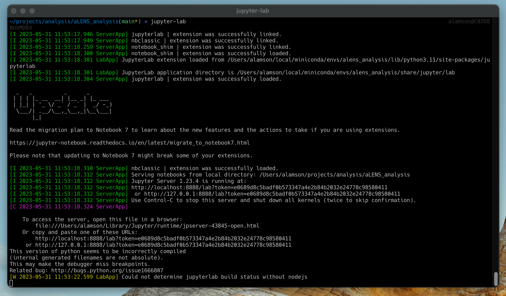

# Day 3: aLENS (part 2) 

https://github.com/flatironinstitute/aLENS

https://lamsoa729-alens.readthedocs.io/en/latest/quickstart.html

https://github.com/flatironinstitute/aLENS_analysis/


## Today's Agenda

| Day 3 <br /> (Wed 6/7) | aLENS (part 2) |
| --- | --- |
| 9:00AM | Current projects (Flexible filaments and transient networks) <br /> Speaker: Adam | 
| 9:30AM | Current projects (Semi-flexible and growing filaments) <br /> Speaker: Dimitrios |
| 10:00AM | Break |
| 10:10AM | Current projects (Bacterial growth) <br /> Speaker: Taeyoon|
| 10:40AM | Tutorial: Analysis package for aLENS and free play <br /> Instructor: Adam |
| ~11:10AM | Break|
| ~11:20AM | Tutorial: Analysis package for aLENS and free play <br /> Instructor: Adam |


## One more software install
https://www.hdfgroup.org/downloads/hdf5/

This has some useful tools for viewing HDF5 files. We will use it to view the data generated by aLENS.


# _ChromaLENS_: Long flexible biopolymers
### Adam Lamson
#### [Presentation (click me)](presentations/Long_flexible_biofilaments.pdf)


# Actin, motors, and confinment modeling
### Dimitrios Vavylonis
#### [Presentation (click me)](presentations/BPM_software_fi_23.pdf)


# Growing bacteria colonies
### Taeyoon Kim
#### [Presentation (click me)](presentations/Workshop_06072023_Taeyoon_Kim.pdf)


# Tutorial: How to analyze aLENS data
### Adam Lamson


## Generate data to analyze
1. Start up docker container and connect to it with 
      ```bash
      docker exec -it alens /bin/bash
      ```
2. From this CLI, navigate to the `Run` directory
    ```bash
    cd /root/Run 
    ```

3.  While still in the CLI, copy the example configuration to the data folder

    ```bash
    cp -r ~/aLENS/Examples/Active3DNematics .
    cd Active3DNematics
    ```

4.  Copy the contents of the `Run` template directory from aLENS to the data folder as well

    ```bash
    cp -r ~/aLENS/Run/* .
    ```

    You should now see an `aLENS.X` executable in this directory along with `result` and `script` directories containing useful scripts for processing, storing, and cleaning up generated files.


5.  Run _aLENS_

    ```bash
    ./aLENS.X
    # or to control the number of cores used
    OMP_NUM_THREADS=<number_of_cores> ./aLENS.
    ```

Let this run in the background while we analyze the data from a previous run.


## Data organization file formats
Data is put into `result/result#-#/` directories to prevent surpassing file limit on ceph.

* Ascii data files: SylinderAscii_#.dat, ProteinAscii_#.dat
  * Human readable positions and orientations
* XML VTK files: ConBlock\_r#\_#.vtp, Sylinder\_r#\_#.vtp, Protein\_r#\_#.vtp
  * Binary files containing all information of systems state. Multiple files for different MPI ranks.
* VTK header files: ConBlock_#.pvtp, Sylinder_#.pvtp, Protein_#.pvtp
  * Human readable files of VTK format for XML files


## Ascii data files

### SylinderAscii_#.dat

First two lines: Number of sylinders, time step. 
<small>
| | *Sylinder type | Global ID | Radius | Minus end x-pos | Minus end y-pos | Minus end z-pos | Plus end x-pos | Plus end y-pos | Plus end z-pos | Group |
| ------------ | ------------------------------------------ | --------- | ------ | --------------- | --------------- | --------------- | -------------- | -------------- | -------------- | ----- |
| **Option/parameter type** | ‘C’  or ‘S’ | int | float | float | float | float | float | float | float | int |
| **Example line** | C | 0 | .0125 | 0 | 0.5 | 0.57 | 20 | 0.5 | 0.57 | -1 |
</small>

*‘C’ for regular cylinder, ‘S’ for stationary sylinder


### ProteinAscii_#.dat
First two lines: Number of proteins, time step
<small>
| Name | Protein character | Global ID | Protein tag | End 0 x-pos | End 0 y-pos | End 0 z-pos | End 1 x-pos | End 1 y-pos | End 1 z-pos | End 0 bind ID | End 1 bind ID |
| ------------ | ----------------- | --------- | ----------- | ----------- | ----------- | ----------- | ----------- | ----------- | ----------- | --------------------- | --------------------- |
| **Option/parameter type** | ‘P’ | int | int | float | float | float | float | float | float | int (-1 if not bound) | int (-1 if not bound) |
| **Example line** | P | 41 | 0 | 8.85976 | 0.5 | 0.5 | 8.85976 | 0.5 | 0.5 | -1 | 2 | </small>


## `aLENS_analysis` package for dealing with data
Often easier to deal with one file than 10$^3$ individual time step files.  `aLENS_analysis` provides collection of ascii and vtk data into HDF5 files for easier analysis.
Other functions:
* Fast common post-processing: autocorrelation functions, density functions, stress calculations, etc.
* Graphing helper functions
* Examples of analysis workflows


## Installing `aLENS_analysis` from git
Outside of the docker run this in your local terminal
(pytorch -> torch)
```bash
# Copy repository
$ git clone https://github.com/flatironinstitute/aLENS_analysis.git
$ cd aLENS_analysis

# Set up conda environment
$ conda env create --file environment.yml
$ conda activate alens_analysis
# or venv environment
$ python -m venv alens_analysis
$ source alens_analysis/bin/activate
$ pip install -r requirements.txt

# Install analysis package
$ pip install -e .

```


## Running data collection routine

```bash
$ analens -A collect
raw_MixMotorSliding
Made time data set in 0.6143820285797119 seconds.
Made sylinder data set in 0.3454399108886719 seconds.
Made protin data set in 1.6398038864135742 seconds.
Made raw data file in a total of 2.6002700328826904 seconds.
 HDF5 raw created in 2.7403640747070312

```
You should see new directory in simulation folder called `analysis` with `raw_MixMotorSliding.h5` file.

* HDF5 is a hierarchical data format that allows for fast access to large datasets.  Learn more about HDF5 and other data formats [here](https://www.neonscience.org/resources/learning-hub/tutorials/about-hdf5) ([video](https://vimeo.com/showcase/7164070/video/797753028) and [slides](https://sciware.flatironinstitute.org/26_DataFormats/slides.html))


## Commandline interface for HDF5 data

Useful tools:

-  `h5ls`: list structure of HDF5 file
-  `h5dump`: print entire contents of HDF5 file

```bash
$ cd analysis
$ h5ls raw_MixMotorSliding.h5
$ h5ls raw_MixMotorSliding.h5/raw_data
$ h5dump raw_MixMotorSliding.h5
$ h5dump -A raw_MixMotorSliding.h5
$ h5dump -d /raw_data/proteins raw_MixMotorSliding.h5
 ```


## Viewing data with `HDFView`
[HDFView](https://www.hdfgroup.org/downloads/hdfview/) is a graphical interface for viewing HDF5 files.
   


## Using `aLENS_analysis` in python

First set up ipython kernel for conda environment
  ```bash
  $ python -m ipykernel install --user --name  alens_analysis --display-name "Python (alens_analysis)"
  ```
  and then run jupyter lab
  ```bash 
  $ jupyter-lab
  ```


  

`<cmd-click>` or `<ctrl-click>` on the text that looks something like `http://localhost:8888/lab?token=<random_string>` to open jupyter lab in browser.


<!-- Things to also talk about:
Slowness of ceph
Zipping files 
-->


