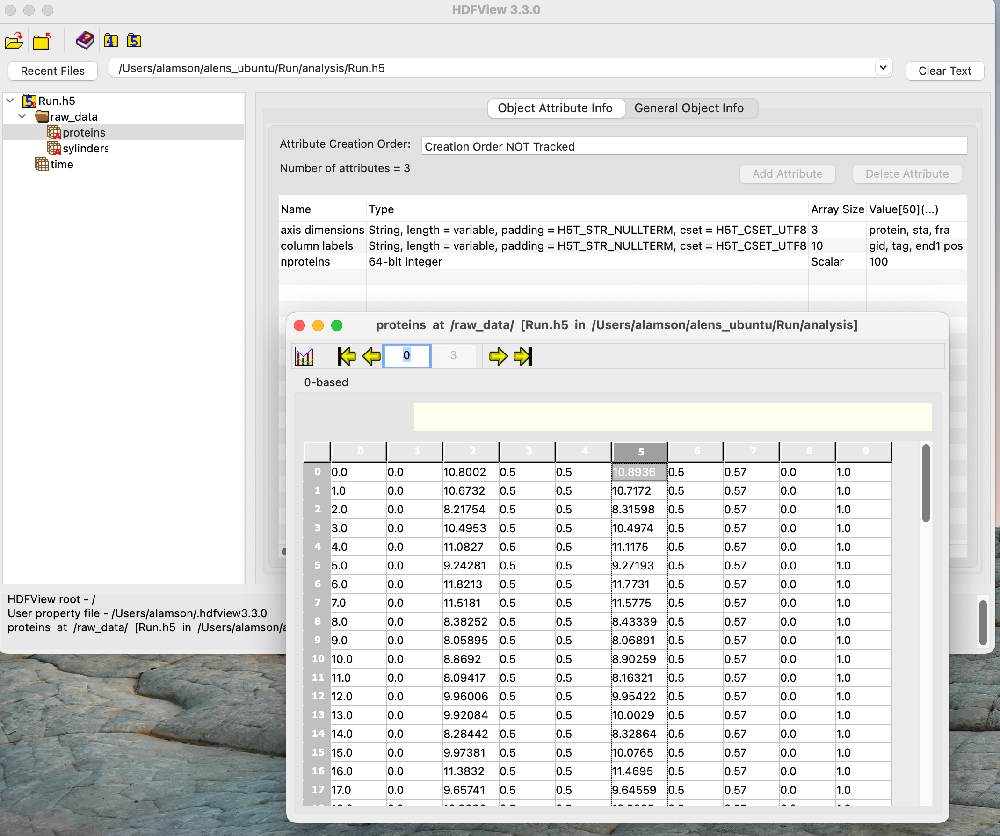

# Day 3: aLENS (part 2) 

https://github.com/flatironinstitute/aLENS

https://lamsoa729-alens.readthedocs.io/en/latest/quickstart.html

https://github.com/flatironinstitute/aLENS_analysis/


## Today's Agenda

| Day 3  (Wednesday 6/7) | aLENS (part 2) |
| --- | --- |
| 9:00AM | Variations and current projects (Flexible filaments and transient networks) <br /> Speaker: Adam | 
| 9:30AM | Variations and current projects (Semi-flexible and growing filaments) <br /> Speaker: Dimitrios |
| 10:00AM | Break |
| 10:10AM | Variations and current projects (Bacterial growth) <br /> Speaker: Taeyoon|
| 10:40AM | Tutorial: Analysis package for aLENS and free play <br /> Instructor: Adam |
| ~11:10AM | Break|
| ~11:20AM | Tutorial: Analysis package for aLENS and free play <br /> Instructor: Adam |


# ChromaLENS: Long flexible biopolymers
### Adam Lamson
TODO: upload presentation


# Actin, motors, and confinment modeling
### Dimitrios Vavylonis
TODO: upload presentation


# Growing bacteria colonies
### Taeyoon Kim
TODO: upload presentation


# Tutorial: How to analyze aLENS data
### Adam Lamson


## Generate data to analyze


## Data organization file formats
Data is put into `result/result#-#/` directories to prevent surpassing file limit on ceph.

* Ascii data files: SylinderAscii_#.dat, ProteinAscii_#.dat
  * Human readable positions and orientations
* XML VTK files: ConBlock\_r#\_#.vtp, Sylinder\_r#\_#.vtp, Protein\_r#\_#.vtp
  * Binary files containing all information of systems state. Multiple files for different MPI ranks.
* VTK header files: ConBlock_#.pvtp, Sylinder_#.pvtp, Protein_#.pvtp
  * Human readable files of VTK format for XML files


## Ascii data files

### SylinderAscii_#.dat

First two lines: Number of sylinders, time step. 
| | *Sylinder type | Global ID | Radius | Minus end x-pos | Minus end y-pos | Minus end z-pos | Plus end x-pos | Plus end y-pos | Plus end z-pos | Group |
| ------------ | ------------------------------------------ | --------- | ------ | --------------- | --------------- | --------------- | -------------- | -------------- | -------------- | ----- |
| **Option/parameter type** | ‘C’  or ‘S’ | int | float | float | float | float | float | float | float | int |
| **Example line** | C | 0 | .0125 | 0 | 0.5 | 0.57 | 20 | 0.5 | 0.57 | -1 |
*‘C’ for regular cylinder, ‘S’ for stationary sylinder

### ProteinAscii_#.dat
First two lines: Number of proteins, time step. (These do not get read for initial condition.)
| Name | Protein character | Global ID | Protein tag | End 0 x-pos | End 0 y-pos | End 0 z-pos | End 1 x-pos | End 1 y-pos | End 1 z-pos | End 0 bind ID | End 1 bind ID |
| ------------ | ----------------- | --------- | ----------- | ----------- | ----------- | ----------- | ----------- | ----------- | ----------- | --------------------- | --------------------- |
| **Option/parameter type** | ‘P’ | int | int | float | float | float | float | float | float | int (-1 if not bound) | int (-1 if not bound) |
| **Example line** | P | 41 | 0 | 8.85976 | 0.5 | 0.5 | 8.85976 | 0.5 | 0.5 | -1 | 2 |


## `aLENS_analysis` package for dealing with data
Often easier to deal with one file than 10$^3$ individual time step files.

`aLENS_analysis` provides collection of ascii and vtk data into HDF5 files for easier analysis.

Other functions:
* Fast common post-processing: autocorrelation functions, density functions, stress calculations, etc.
* Graphing helper functions
* Examples of analysis workflows


## Installing `aLENS_analysis` from git

```bash
# Copy repository
$ git clone https://github.com/flatironinstitute/aLENS_analysis.git
$ cd aLENS_analysis

# Set up conda environment
$ conda create -n alens_analysis --file environment.yml
$ conda activate alens_analysis
# or venv environment
$ python -m venv alens_analysis
$ source analysis/bin/activate
$ pip install -r requirements.txt

# Install analysis package
$ pip install -e .

```
<!-- Try to get conda environment working  -->


## Running data collection routine

```bash
$ analens -A collect

```
Should see new directory in simulation folder called `analysis` with `MixMotorSliding.h5` file.
HDF5 is a hierarchical data format that allows for fast access to large datasets.


## Commandline interface for HDF5 data

Useful tools
* `h5ls`: list structure of HDF5 file
* `h5dump`: print entire contents of HDF5 file

```bash
$ cd analysis
$ h5ls Run.h5
$ h5ls Run.h5/raw_data
$ h5dump Run.h5
$ h5dump -A Run.h5
$ h5dump -d /raw_data/proteins Run.h5
 ```


## Viewing data with `HDFView`
[HDFView](https://www.hdfgroup.org/downloads/hdfview/) is a graphical interface for viewing HDF5 files.
   


## Using `aLENS_analysis` in python

First set up ipython kernel for conda environment
  ```bash
  $ python -m ipykernel install --user --name  alens--display-name "Python (<name_of_env>)"
  ```
  and then run jupyter lab
  ```bash 
  $ jupyter-lab
  ```


<!-- TODO: What should they see for aLENS -->
Todo: add example notebook image of using aLENS_analysis

## Calling functions from `aLENS_analysis` package
todo: Image of calling functions from alens_analysis package


<!-- ## Plotting data with `aLENS_analysis` -->


## Saving post-process data in hdf5 file


<!-- Things to also talk about:
Slowness of ceph
Zipping files 
-->


