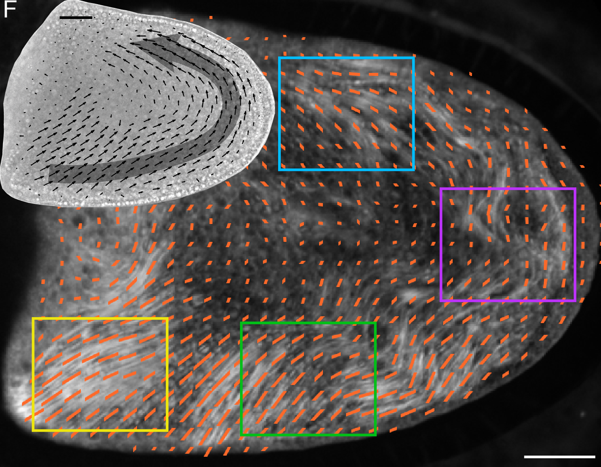
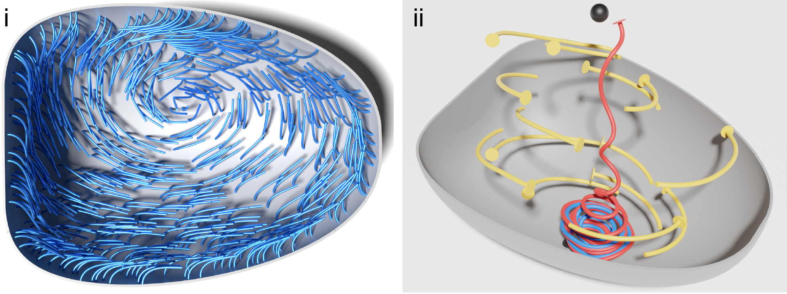

# Day 4: SkellySim (part 1)
https://github.com/flatironinstitute/SkellySim

## Today's Agenda

| Day 4  (Thursday 6/8) | SkellySim (part 1)                                                               |
|-----------------------|----------------------------------------------------------------------------------|
| 9:00AM                | Intro to SkellySim (**Robert Blackwell (SCC)**)                                  |
| 9:30AM                | Computational methods and code structure   **David Stein (CCB)**            |
| 10:00AM               | Break                                                                            |
| 10:10AM               | Tutorial: Running SkellySim for the first time   **Robert Blackwell (SCC)** |
| ~10:40AM              | Tutorial: Parameter files and free play   **Robert Blackwell (SCC)**        |
| ~11:00AM              | Break                                                                            |
| ~11:10AM              | Free play (Speaker: **Coordinators**)                                            |
| ~11:40AM              | Visualizing with Blender (**Reza Farhadifar, CCB**)                              |
|                       |                                                                                  |

# Intro to

https://github.com/flatironinstitute/SkellySim

Robert Blackwell (author)

## What is SkellySim?
### ...and why the weird name?

* Cytoskeleton (skelly) simulator (sim)
  * Doesn't hurt that it is very similar to Shelley
* Full hydrodynamic simulation of
  * Fibers: Microtubules or other flexible filaments
  * Bodies: Smooth 'rigid' objects like organelles or MTOCs
  * Periphery: Smooth/convex containing volume (cell boundary)

## Why is SkellySim?
### Can't aLENS do those things?

* In some ways, yes. In others, no.
  * Full hydro
  * More rigorous flexible filaments
  * No fiber-fiber interaction
  * Doesn't scale to millions of elements

## Why is SkellySim? (2)
### Microtubule-induced cytoplasmic streaming in oocytes

## Why is SkellySim? (3)
### A history

* Ground-up re-write of work in BPM by **Gokberk Kabacaoglu** (now at Bilkent University, Ankara)
  * Which itself was an extension of work by **Florencio Balboa Usabiaga** (now at Basque Center for Applied Math)
  * Original python code had limited extendability and scalability
  * Solver stalled in large and unavoidable external "serial" code portions
  * Re-write started in October 2020
  * Currently ~50x faster than original implementation (iirc)

## Focus of re-write (with self-grade)

* Extensible: **B-**
  * Components should allow for different implementations
  * Easy to add new functionality without breaking other components
* Fast/scalable: **A+**
  * Code should strive to scale linearly with elements and cores
* Readability: **C+**
  * Code should be readable with an intermediate knowledge of `C++`
* Documented: **B**
  * Should have usable developer and user documentation
* Usable: **A-**

## SkellySim technology overview

* Medium-sized `C++/python` code leveraging:
  * `MPI` to distribute calculation for simulation objects
  * `Trilinos` for `GMRES` solver to resolve "global" matrix equations
  * `Eigen` for "local" matrix/vector computations
  * `PVFMM/STKMM` for hydrodynamic calculations
    * `CUDA` and `CPU` direct solvers for smaller systems
  * `msgpack` for serialization/inter-language communication
* ~6800 lines of `C++`
* ~4200 lines of `python`

# Computational methods and code structure
